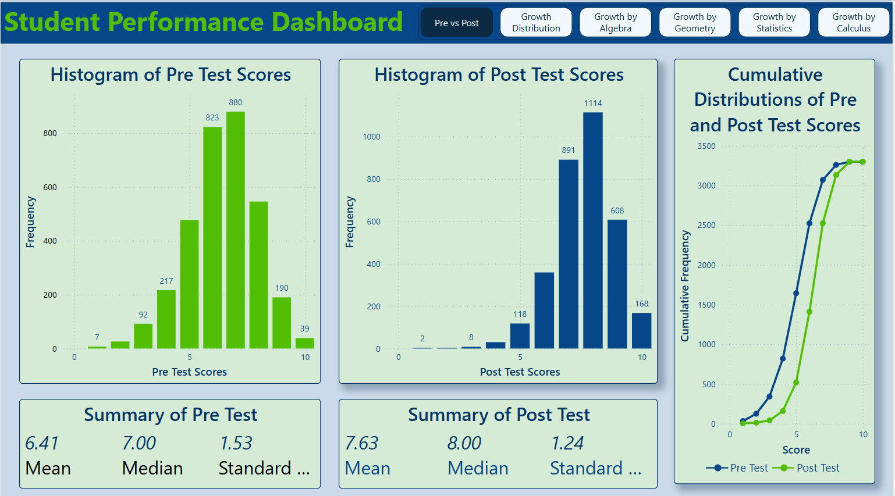
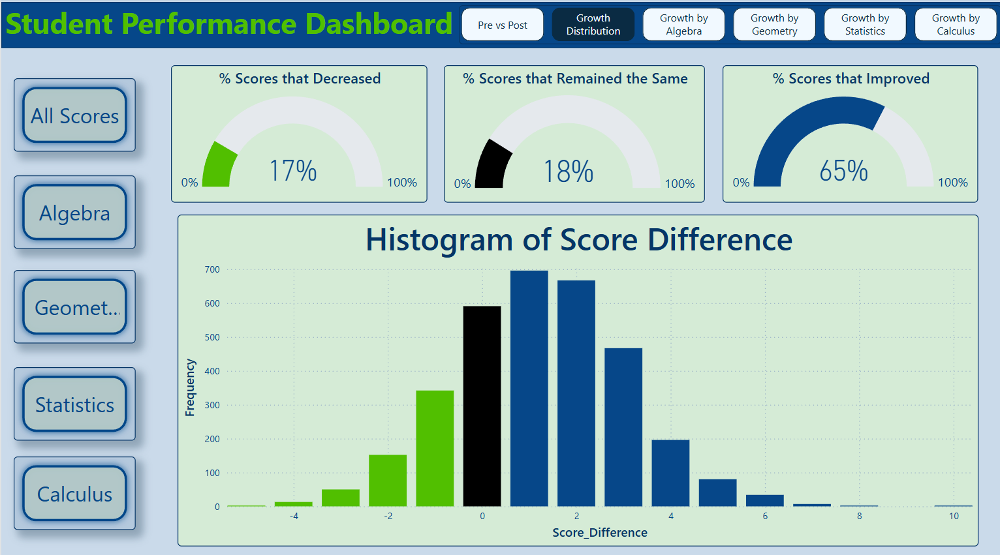
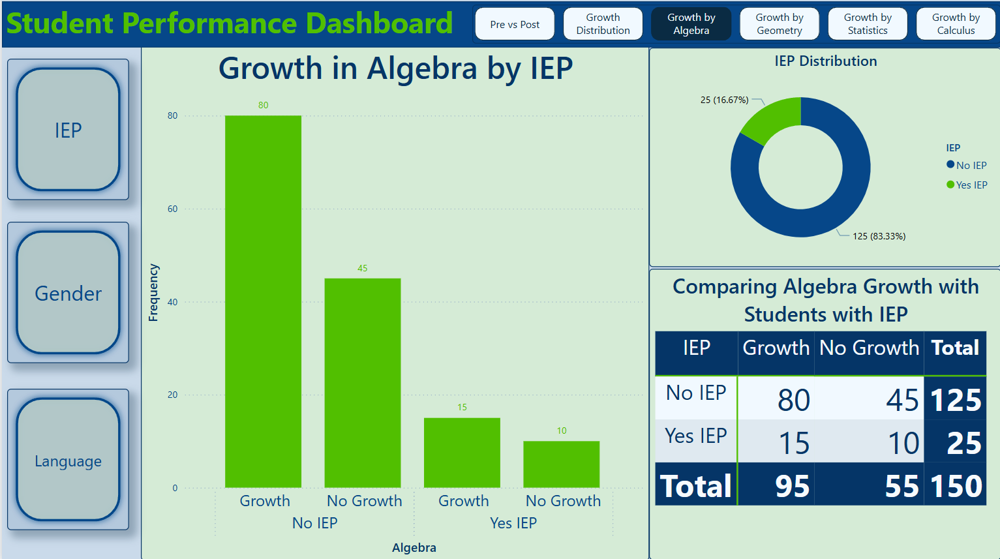

## Project Summary

For my teaching tenure presentation, I created this Power BI dashboard to demonstrate my impact on student learning. Using a collection of pre- and post-test scores based on benchmark assessments, the dashboard highlights the growth my students achieved across multiple math courses. It presents overall improvement trends, growth by individual course, and disaggregated data for special populations, including language learners, students with IEPs, and gender groups. This tool helped communicate student progress to stakeholders in a clear, data-driven way.

## Screenshots

### Dashboard Overview
  
_Main dashboard view with an overview of pre-test scores compared to post-test scores._

### Overall Breakdown
  
_Shows the score difference of all students for all courses, and breaks down the percent of students who improved overall._

### Course Breakdown
  
_Shows growth per course by special populations (language, gender, and IEP)._
